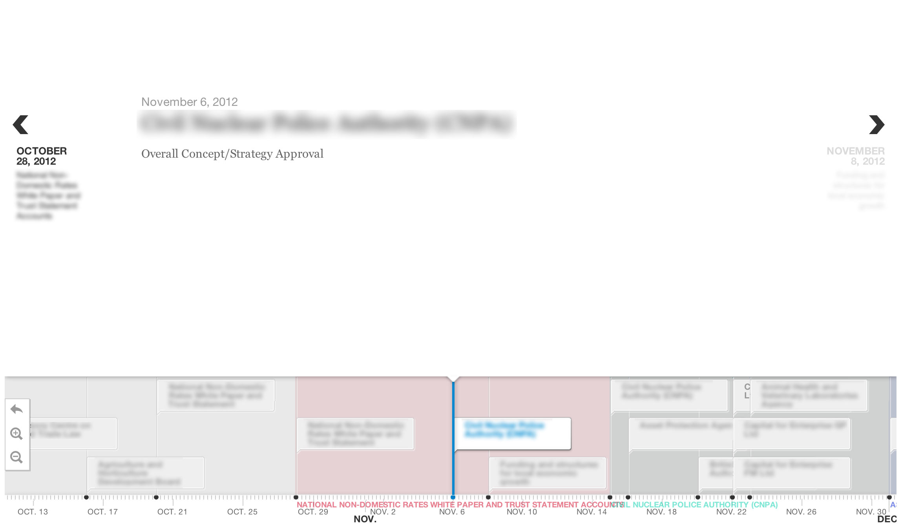

data
====

## Anders

Uses Ruby/Sinatra and a series of .rb files for data munging.

Use foreman to start the server.

## Max

**Milestone Viewer**
A Rails app that uses [timeline.js](https://github.com/NUKnightLab/TimelineJS), or more-specifically it uses [the Rails version](https://github.com/nanjingboy/timelineJS-rails), to show milestone dates within projects within the NAO.

Data was originally parsed from a CSV export (parser in the app).

**Assurance Barometer**
A parser to create a table visualisation for specific projects. Designed to show three main data points:
* Whether the project had it's target date moved.
* Whether the project was completed within it's target date.
* How many days from the start of the financial year was the project completed.